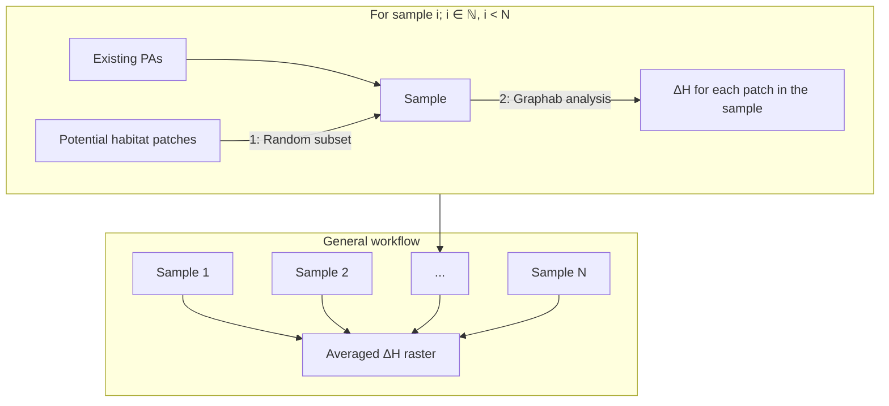
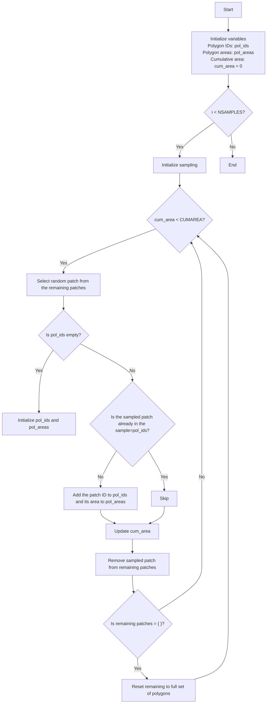

# ZHConnect
Connectivity analyses within Canton ZH.

## (Sub)project workflow
### Preliminary work (Philipp):
- The canton is dissected into (ideally) homogeneous patches of similar and reasonable size to be considered potential future protected areas (pFPAs).
- For the habitat type of interest, a resistance map is created, based on SDMs.

### Connectivity analysis
Samples are created by adding random subsets of the patches to the existing PAs. For each sample _i_, a Δ-analysis is performed in Graphab: For each patch _j_ within the sample, a connectivity metric (we used the Harary index) is calculated for the entire network. Subsequently, the same metric is calculated after removing patch _j_. The difference Δ is attributed to patch _j_. The results are summarised in a raster file which contains values for every patch present in sample _i_. In a second step, an average Δ metric is calculated across all samples.

Considerations:
- The number of samples N should be as large as possible.
- However, computation time t(N) is a linear function with a positive slope. To limit computation effort, a reasonable value must be selected. Preliminary analyses showed relatively stable estimates when each pFPA was included in about 30 samples.
- Connectivity metrics often use parameters. For Harary index, the relevant parameter is a maximum distance _d_ below which two patches are considered connected. A reasonable estimate of _d_ must be provided. For single-species analyses, the species-specific value may be obtained from the literature. For multi-species analyses, a small (but no too small) value can be used to ensure most species of interest are able to migrate across that distance.
- Since we are using resistance maps, distance _d_ must be provided in the unit of cumulative cost across a path. Euclidean distance is converted to cumulative cost by 1) creating a graph with a high threshold value, 2) establishing a relationship between euclidean distance and cumulative cost within a relevant range, and 3) using the parameters to translate the selected euclidean distance value into a cumulative cost value.

ad 1: Random subset
- A random subset is created from the existing PAs in combination with samples from pFPAs.

The following flowchart describes the sampling algorithm:
`NSAMPLES`= N
`CUMAREA` = Target area (total additional protected area for a future scenario)
Patches are provided as polygons with an ID and an area.

